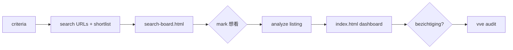

# Dutch Home Purchase Assistant

AI-assisted Funda workflow: **criteria → search → analyze → VvE audit → HTML dashboard**.

Your criteria live in `config/buyer-profile.yaml`. Transport is scored by **tier** (S / A / B / watchlist), not city blacklists.

---

## Quick start (5 minutes)

```bash
cd dutch-home-purchase

# 1. Generate Funda search URLs (default: tier S+A)
python3 scripts/build_search_urls.py
python3 scripts/build_search_urls.py --tier all   # include Almere, Den Haag, Zaandam, …

# 2. After updating data/search/shortlist.json (agent or manual)
python3 scripts/regenerate_all.py

# 3. Open in browser
open dashboard/search-board.html   # search inbox — mark 想看 / 仅追踪 / 跳过
open dashboard/index.html          # fully analyzed listings
```

**Search board** selections are stored in browser **localStorage** (use “导出 JSON” to back up).

---

## Skill architecture

Canonical skills: `dutch-home-purchase/.cursor/skills/`  
Cursor discovers them via symlinks at **`side-project/.cursor/skills/`** (workspace root).

```
dutch-home-purchase          ← orchestrator (routes by intent)
├── dutch-home-criteria      ← budget, must-haves, transport tiers
├── dutch-home-search        ← Funda search + shortlist + inbox
├── dutch-home-analyze       ← score listing + CBS bid + dashboard
└── dutch-home-vve           ← post-viewing VvE / MJOP audit
```

### Transport tiers (this buyer)

| Tier | Meaning | Examples |
|------|---------|----------|
| **S** | Metro direct to Amsterdam Zuid | Bijlmer, Ganzenhoef corridor, Amstelveen metro |
| **A** | Train ~1 stop to Zuid | Hoofddorp Centraal (2132) |
| **B** | ~1h train OK if size/price wins | Almere, Zaandam, Den Haag suburbs, Floriande |
| **watchlist** | Compare only, won't visit | e.g. Rotterdam Nesselande (~2h) |

---

## Integration: Cursor

1. Open workspace folder **`side-project`** (not only `dutch-home-purchase/`).
2. Symlinks should already exist:

   ```bash
   ls -la .cursor/skills/dutch-home-*
   ```

   If missing, from repo root:

   ```bash
   mkdir -p .cursor/skills
   for s in dutch-home-purchase dutch-home-criteria dutch-home-search dutch-home-analyze dutch-home-vve; do
     ln -sf "$(pwd)/dutch-home-purchase/.cursor/skills/$s" .cursor/skills/$s
   done
   ```

3. In chat, invoke by name or intent:

   | Intent | Example |
   |--------|---------|
   | Update criteria | `@dutch-home-criteria` 或「预算改成 45 万」 |
   | Search | `@dutch-home-search` 或「按 tier 重新搜房」 |
   | Analyze one URL | `@dutch-home-analyze` + paste Funda link |
   | After viewing | `@dutch-home-vve` + jaarverslag / VvE docs |
   | Unsure | `@dutch-home-purchase` — orchestrator picks sub-skill |

4. If skills don't appear: **Reload Window** (Cmd+Shift+P → *Developer: Reload Window*).

---

## Integration: Codex (CLI)

Link skills into Codex global skills directory (once per machine):

```bash
cd /path/to/side-project
mkdir -p ~/.codex/skills
for s in dutch-home-purchase dutch-home-criteria dutch-home-search dutch-home-analyze dutch-home-vve; do
  ln -sf "$(pwd)/dutch-home-purchase/.cursor/skills/$s" ~/.codex/skills/$s
done
```

Then run Codex **inside `dutch-home-purchase/`** (or with that folder in context):

```bash
cd dutch-home-purchase
codex "Read dutch-home-search skill and regenerate search shortlist + HTML board"
```

Codex reads `SKILL.md` from `~/.codex/skills/` automatically when relevant.

---

## Integration: Claude Code

Claude Code uses project-level instructions. Options:

**Option A — Project `CLAUDE.md`** (recommended): add at `dutch-home-purchase/CLAUDE.md`:

```markdown
# Dutch home purchase

Read skills from `.cursor/skills/dutch-home-purchase/SKILL.md` and route to sub-skills.
Criteria: `config/buyer-profile.yaml`. Working dir: this folder.
After search: `python3 scripts/regenerate_all.py` → open `dashboard/search-board.html`.
```

**Option B — Copy skills to Claude's skill path** if your setup supports it (same files as Cursor; symlink is fine):

```bash
# Example: if Claude Code reads .claude/skills in project
mkdir -p dutch-home-purchase/.claude/skills
for s in dutch-home-purchase dutch-home-criteria dutch-home-search dutch-home-analyze dutch-home-vve; do
  ln -sf "../.cursor/skills/$s" "dutch-home-purchase/.claude/skills/$s"
done
```

**Typical Claude Code prompts:**

- `Follow dutch-home-search: run tier-all search and update shortlist + search-board.html`
- `Follow dutch-home-analyze: https://www.funda.nl/detail/koop/...`
- `Follow dutch-home-criteria: I want Ganzenhoef as tier S priority`

---

## Typical workflow



1. **Criteria** — edit `config/buyer-profile.yaml` or chat `@dutch-home-criteria`
2. **Search** — `@dutch-home-search` → updates `data/search/shortlist.json` + inbox
3. **Browse** — open `dashboard/search-board.html`, mark favorites
4. **Analyze** — paste Funda URL → `@dutch-home-analyze` → scores + bid estimate in `dashboard/index.html`
5. **VvE** — after viewing → `@dutch-home-vve`

---

## Commands reference

```bash
cd dutch-home-purchase

# Search
python3 scripts/build_search_urls.py              # tier S+A (default)
python3 scripts/build_search_urls.py --tier all   # all zones including watchlist
python3 scripts/build_search_urls.py --tier B     # ~1h train towns only

# Data pipeline
python3 scripts/sync_inbox.py                     # shortlist → data/inbox.json
python3 scripts/regenerate_all.py                 # inbox + both HTML boards

# Analysis
python3 scripts/add_listing.py --file listing.json
python3 scripts/reestimate_all.py                 # refresh CBS bid estimates
python3 scripts/fetch_cbs_market.py               # refresh CBS cache
```

---

## Project layout

```
dutch-home-purchase/
├── config/
│   ├── buyer-profile.yaml       # Budget, hard reqs, transport tiers
│   ├── search-zones.json        # Zones + Funda paths + tier
│   └── regional-pricing.json    # Level 1 bid model
├── criteria/
│   ├── scoring-rubric.md
│   └── pricing-model.md
├── data/
│   ├── listings.json            # Analyzed properties (deep dive)
│   ├── inbox.json               # Merged search inbox
│   └── search/
│       ├── shortlist.json       # Latest search results
│       └── funda_search_urls.json
├── dashboard/
│   ├── index.html               # Analysis board
│   └── search-board.html        # Search inbox (interactive)
├── scripts/
└── .cursor/skills/              # Agent skills (symlinked to workspace root)
```

---

## Funda limitation

Funda blocks automated scraping (captcha). The agent uses search snippets + your Funda app; **verify listing status and details in Funda before booking viewings**. Paste exact Funda URLs into chat for `@dutch-home-analyze`.

---

## For other users

Run **dutch-home-criteria** first to generate a new `buyer-profile.yaml` and `search-zones.json` — same pipeline, different config.
